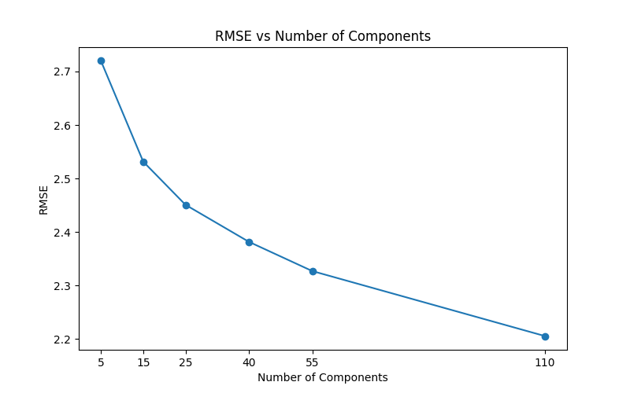

# Movie Recommendation System using Non-Negative Matrix Factorization (NMF)

This project implements a movie recommendation system using Non-Negative Matrix Factorization (NMF) based on the MovieLens 1M dataset. The system predicts user ratings for movies and recommends movies to users based on their predicted preferences.

## Table of Contents
- [Overview](#overview)
- [Dataset](#dataset)
- [Features](#features)
- [Requirements](#requirements)
- [Installation](#installation)
- [Usage](#usage)
- [Project Structure](#project-structure)
- [How It Works](#how-it-works)
- [Contributing](#contributing)
- [License](#license)
- [Citation](#citation)
- [Acknowledgements](#acknowledgements)

## Overview
The project leverages NMF, a matrix factorization technique, to build a collaborative filtering-based recommendation system. It processes user-movie rating data to predict unseen ratings and suggest movies that users are likely to enjoy. The system evaluates performance using Root Mean Squared Error (RMSE) and supports experimentation with different numbers of latent factors.

## Dataset
The project uses the [MovieLens 1M dataset](https://grouplens.org/datasets/movielens/1m/), which contains:
- **1,000,209** anonymous ratings of approximately **3,900** movies.
- Ratings from **6,040** MovieLens users.
- Movie metadata (titles and genres).
- User demographic information (gender, age, occupation, zip-code).

The dataset is included in the `ml-1m/` directory and consists of three main files:
- `movies.dat`: Movie information (MovieID, Title, Genres).
- `ratings.dat`: User ratings (UserID, MovieID, Rating, Timestamp).
- `users.dat`: User demographics (UserID, Gender, Age, Occupation, Zip-code).

For detailed dataset information, see `ml-1m/README`.

## Features
- **Recommendation Generation**: Suggests top-N movies for a given user based on predicted ratings.
- **Performance Evaluation**: Computes RMSE to assess prediction accuracy.
- **Hyperparameter Tuning**: Tests different numbers of NMF components to optimize performance.
- **Visualization**: Plots RMSE versus the number of components for analysis.

## Requirements
- Python 3.13 or higher
- Dependencies listed in `pyproject.toml`:
  - `matplotlib>=3.10.3`
  - `pandas>=2.2.3`
  - `scikit-learn>=1.6.1`

## Installation
1. **Clone the Repository**:
   ```bash
   git clone https://github.com/akatakan/Non-Negative-Matrix---Recommender.git
   cd Non-Negative-Matrix---Recommender
   ```

2. **Set Up a Virtual Environment** (recommended):
   ```bash
   python -m venv venv
   source venv/bin/activate  # On Windows: venv\Scripts\activate
   ```

3. **Install Dependencies**:
   Using `uv` (recommended for faster dependency resolution):
   ```bash
   pip install uv
   uv pip install .
   ```
   Alternatively, using `pip`:
   ```bash
   pip install .
   ```

4. **Download the Dataset**:
   The MovieLens 1M dataset is included in the `ml-1m/` directory. Ensure the files (`movies.dat`, `ratings.dat`, `users.dat`) are present.

## Usage
1. **Run the Main Script**:
   The `main.py` script trains the NMF model and generates movie recommendations for a specified user.
   ```bash
   python main.py
   ```
   By default, it recommends the top 2 movies for user index 66 using 55 NMF components.

2. **Evaluate Different Components**:
   To test the effect of different numbers of NMF components on RMSE, uncomment the `test_n_component` call in `main.py`. This will generate a plot of RMSE versus component numbers.

   

3. **Customize Recommendations**:
   Modify the `user_index` and `n` parameters in the `recommend_movie` function call in `main.py` to get recommendations for different users or a different number of movies.

   Example output:
   ```
   Pulp Fiction (1994) - Rating: 4.82 for User 66
   The Shawshank Redemption (1994) - Rating: 4.75 for User 66
   ```

## Project Structure
```
.
├── ml-1m/                  # MovieLens 1M dataset
│   ├── movies.dat
│   ├── ratings.dat
│   ├── users.dat
│   └── README
├── utils/                  # Utility functions
│   └── util.py
├── main.py                 # Main script for training and recommendations
├── pyproject.toml          # Project metadata and dependencies
├── uv.lock                 # Dependency lock file
├── .python-version         # Specifies Python version
└── README.md               # This file
```

## How It Works
1. **Data Loading**:
   - The `read_dat` function in `utils/util.py` loads the dataset files into pandas DataFrames.
   - A user-movie rating matrix is created using `pivot`, with missing ratings filled with zeros for NMF.

2. **NMF Training**:
   - The `train` function applies NMF to factorize the rating matrix into user (`W`) and movie (`H`) latent factor matrices.
   - Predicted ratings are computed as the dot product of `W` and `H`.

3. **Recommendation**:
   - The `recommend_movie` function identifies unrated movies for a user and suggests the top-N movies based on predicted ratings.

4. **Evaluation**:
   - The `compute_rmse` function calculates the RMSE between actual and predicted ratings.
   - The `test_n_component` function evaluates RMSE for different numbers of NMF components and visualizes the results.

##Ideas for Further Development
Incorporate Content-Based Features: Use movie genres or user demographics from the dataset to create a hybrid recommendation system, combining collaborative filtering with content-based filtering for more personalized recommendations.

Cold Start Handling: Develop strategies to recommend movies for new users or movies with few ratings, such as using popularity-based recommendations or clustering users by demographics.

Web API: Build a simple web api using Flask or FastAPI to allow users to input their ID and receive movie recommendations interactively.

Diversity in Recommendations: Modify the recommendation logic to promote diversity in suggested movies, ensuring a mix of genres or less popular titles to enhance user discovery.

Unit Tests: Add unit tests using pytest to verify the functionality of data loading, NMF training, and recommendation generation, improving code reliability.

## License
This project is licensed under the MIT License. See the [LICENSE](LICENSE) file for details.

**Note**: The MovieLens dataset has specific usage terms (see `ml-1m/README`). Ensure compliance with these terms, including non-commercial use and proper citation.

## Citation
To acknowledge the use of the MovieLens dataset, cite:
> F. Maxwell Harper and Joseph A. Konstan. 2015. The MovieLens Datasets: History and Context. ACM Transactions on Interactive Intelligent Systems (TiiS) 5, 4, Article 19 (December 2015), 19 pages. DOI: [http://dx.doi.org/10.1145/2827872](http://dx.doi.org/10.1145/2827872)

## Acknowledgements
- The MovieLens dataset is provided by the [GroupLens Research Project](http://www.grouplens.org/) at the University of Minnesota.
- Thanks to Shyong Lam and Jon Herlocker for preparing the dataset.
- Built with Python, pandas, scikit-learn, and matplotlib.
